# Procesverslag
Markdown is een simpele manier om HTML te schrijven.  
Markdown cheat cheet: [Hulp bij het schrijven van Markdown](https://github.com/adam-p/markdown-here/wiki/Markdown-Cheatsheet).

Nb. De standaardstructuur en de spartaanse opmaak van de README.md zijn helemaal prima. Het gaat om de inhoud van je procesverslag. Besteedt de tijd voor pracht en praal aan je website.

Nb. Door *open* toe te voegen aan een *details* element kun je deze standaard open zetten. Fijn om dat steeds voor de relevante stuk(ken) te doen.

## Jij

  ### Auteur:
  Elles Kreuk

  #### Je startniveau:
  Blauw 

  #### Je focus:
  Surface plane 
 

## Je website

  ### Je opdracht:
  https://www.mcdonalds.com/nl/nl-nl.html

  #### Screenshot(s) van de eerste pagina (small screen): 
  Mcdonalds
  

  #### Screenshot(s) van de tweede pagina (small screen):
  Goed om te weten 
  
 

## Toegankelijkheidstest 1/2 (week 1)

  Met de screenreader heb je geen volgend kopniveau. Als je op de k drukt ga je meteen helemaal naar beneden bij de footer. Als ik op de h druk ga je naar de stukjes die gaan over het vinden van een baan. Als je een aantal keer op het pijltje drukt gaat de screenreader de woorden spellen. Heel veel funties worden voorgelezen met koppeling etc. Zo weet je wel meteen dat je daar op kan klikken. Het legt bij een aantal uit wat je bij die koppeling kan doen. Als je met de tabtoets over de pagina gaat komt er een zwart randje om de verschillende funties.

  
  
  
  
  

  ### Bevindingen
-De website heeft veel errors in de html.
-Er zijn maar 2 soorten headings die gebruikt worden 2 en 5
-De afbeeldingen hebben niet allemaal een alt tekst, en er zijn afbeeldingen met een alt tekst die niet kloppen.
-Niet bij alle afbeeldingen waar tekst in staat is de tekst goed te lezen.
-De website maakt gebruik van simpel/normaal taalgebruik.
-De website heet geen microinteracties.
-Als met de screenreader met tab over de pagina heen gaat komt er een zwart randje op de verschillende functies.
-De website is goed te gebruiken op de mobiel, alleen zijn er een aantal afbeeldingen die niet wilde laden.

## Breakdownschets (week 1)

  ### de hele pagina: 
  

  ### dynamisch deel (bijv menu): 
    

## Voortgang 1 (week 2)

  ### Stand van zaken
  Het schrijven van de html ging wel redelijk goed. Ik heb al alle tekst en afbeeldingen in een header, body en footer gezet. Ik heb al een aantal dingen opgesplitst in sections en articles. En in css al wat geprobeerd met borders, margins, fonts, widhts. Wel moet ik nog kijken naar hoe ik alles in de nav ga zetten.

  ### Agenda voor meeting

  student 1 Elles:
  -Ik zou graag willen weten hoe je de css op de 2e pagina kan krijgen. Aangezien alles van de eerste pagina ook word toegepast op de 2e.
  -Wat kan ik het beste toepassen bij de cheeseburger/afbeeldingen en hoe? (flexbox/grid)
  -Hoe kan ik een uitklap menu maken, die zichtbaar wordt als de pagina een groter formaat is?

  student 2 Artemis:
  -Problemen met het starten van het maken van de website

  student 3 Marie Janette:
  -Een schuifknop, indeling van afbeelding

  student 4 Brita: -

  ### Verslag van meeting

  - focus state voor toegankelijkheid
  - op de body een class zetten op de 2e pagina (aan docent vragen) en anders een 2e css
  - media query, als mijn scherm zo groot is dan doet het dit @media only screen (max widht)
  - menu ook met @media.. en de opdracht maken over het hamburger menu
  - possition relative voor hamburger plaatje, position absolute voor tekst, left: ..px en dan ook weer aanpassen voor mobiele versie

## Voortgang 2 (week 3)

  ### Stand van zaken
  Ik was eigenlijk nog niet verder gegaan aan mijn website, dus heb ik niet een foto om te laten zien hoe ver ik was.

  ### Agenda voor meeting

  student 1 Elles: Kan ik een class op de body zetten voor op de 2e pagina?

  student 2 Artemis: Hoe krijg ik een stuk tekst over een afbeelding

  student 3 Marie Janette: Hoe kan ik een video toevoegen en hoe stopzetten?

  ### Verslag van meeting
  hier na afloop snel de uitkomsten van de meeting vastleggen

  - @media query motion stopzetten
  - Met een class op de body kan je de pagina's onderscheiden
  - Met positioning kan je elementen over een element zetten

## Toegankelijkheidstest 2/2 (week 4)

  ### Bevindingen
  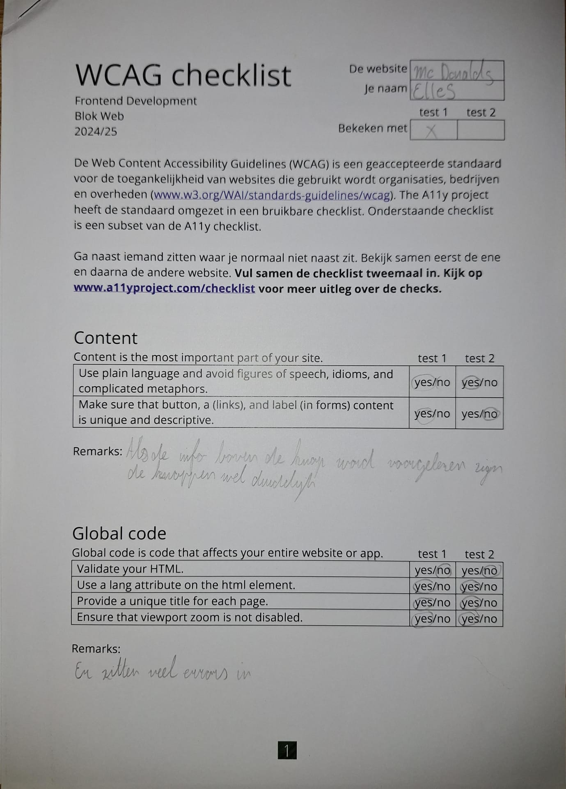
  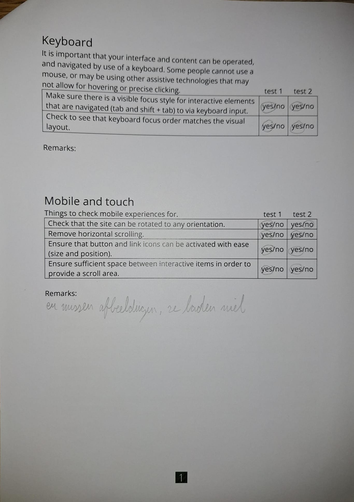
  
  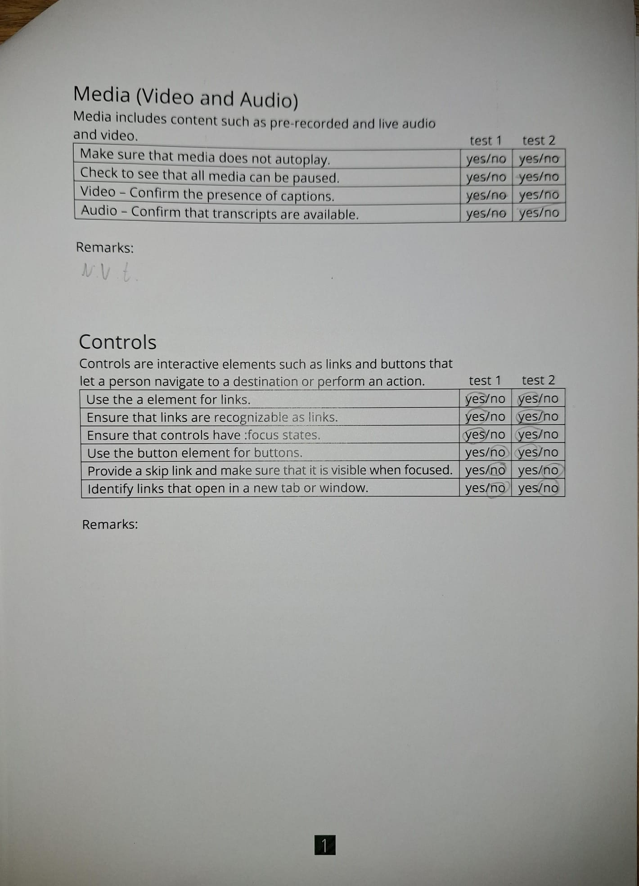
  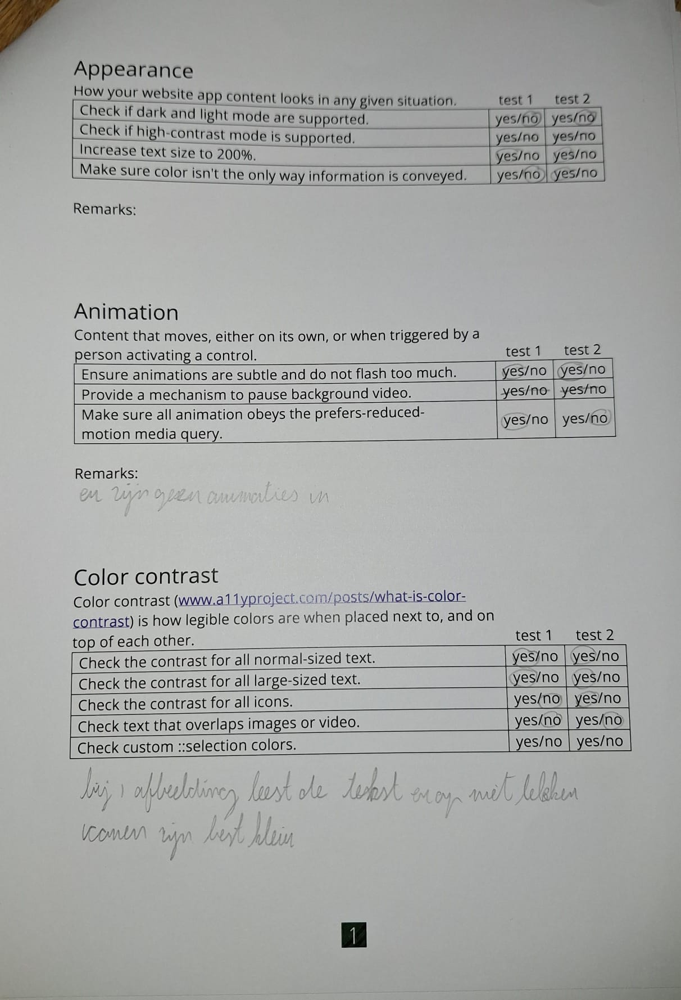

-Ik kwam er achter dat mijn website nog niet heel toegankelijk is, maar dat komt ook omdat mijn website nog niet helemaal af was.
-Zo is de focus state nog niet heel mooi 
-Ik moet nog een aantal alt teksten toevoegen
-Het contrast is wel goed op mijn pagina
-Ik heb verschillende headings op volgorde
-Ik heb geen skiplink

## Voortgang 3 (week 4)

  ### Stand van zaken
  - Ik had moeite met het toevoegen van een sluit knop in het menu. 
  - Het maken van de grids ging erg goed.
  - Het potitioneren lukte ook.
  - Ik had wel al de html voor de 2e pagina, alleen moest ik deze nog stylen.

 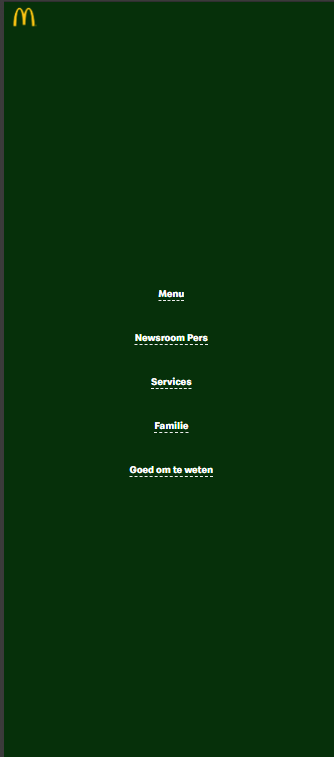
 
 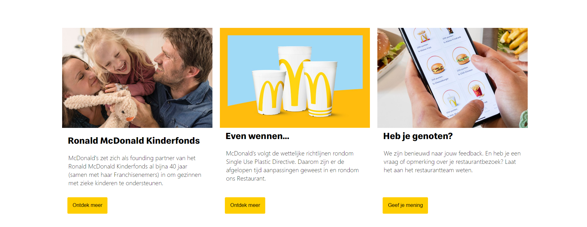

  ### Agenda voor meeting
  student 1 Elles: Hoe toon je de sluitknop in een hamburger menu? Hoe kan ik de Focus state goed vormgeven, die bij mij een beetje raar.

  student 2 Marie Janette: Mijn menu verdwijnt achter de teksten hoe kan ik dit oplossen.

  student 3 Brita: Nav naast elkaar flexen? :avtive class toevoegen?

  student 4 Kelly Neutel: geen vraag gestelt

  ### Verslag van meeting
 
  - Ik ga mijn sluit button in de nav zetten en deze rechts boven zetten. 
  - Op het mcdonalds logo ga ik een z-index zetten, zodat deze voor de nav te voor schijn komt.
  - Focus state kan niet anders getoont worden.
  - Ik had a op de buttons gezet, maar dat hoeft helemaal niet.
  - Ik heb Marie Janette geholpen, foor te zeggen dat ze position moest toepassen en een z-index op haar menu moest zetten.

## Eindgesprek (week 5)

  
uitwerken voor eindgesprek

  ### Je uitkomst - karakteristiek screenshots:
  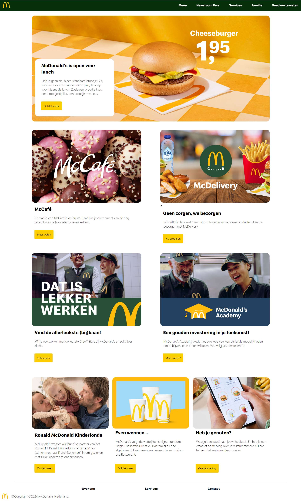
  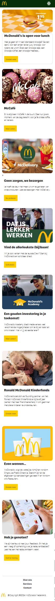
  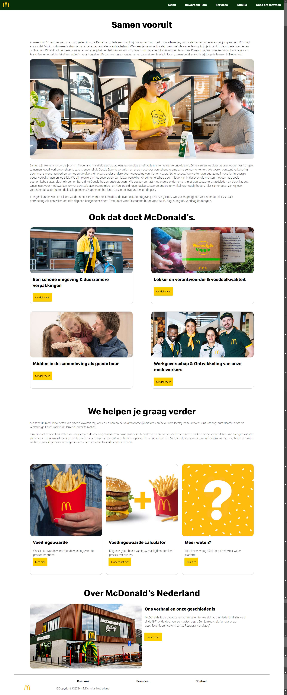
  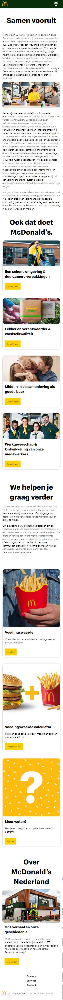

  ### Dit ging goed/Heb ik geleerd: 
  Korte omschrijving met plaatjes
  - Ik heb dit blok geleerd om grids te maken, te positioneren, animaties te maken.
  - Ook heb ik nu gedacht aan de toegankelijkheid, door als je over een knop hovert, je een kleur krijgt en de knop groter wordt. Of door alt teksten en aria labels toe te voegen. Ook heb ik een focus state toegevoegd.
  - Ook heb ik gekeken naar welke aanpassingen in kon maken aan het orginele design. Ik heb de randen ronder gemaakt en de header een pop of color gegeven. 

  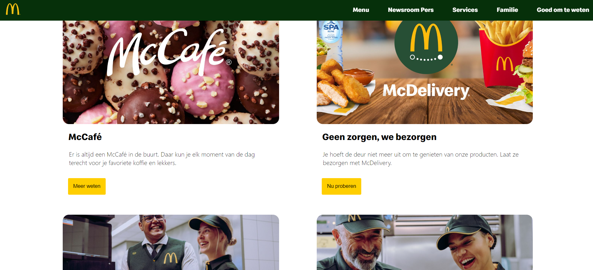

  ### Dit was lastig/Is niet gelukt:
 - Ik wilde een skip link maken, ik was hier ook mee bezig. Alleen had ik net niet genoeg tijd om het voor elkaar te krijgen, ik moest dan alles in mijn css aanpassen met main ervoor. Eerst had ik wel wat moeite met het maken van de grids, maar na het terug kijken van de opdrachten die we hiervoor hadden gemaakt ben ik er uiteindelijk uitgekomen.
 - Het maken van het hamburger menu vond ik wel erg lastig, ik heb ook om hulp gevraagd aan de docent, studentassistent en medestudenten.

  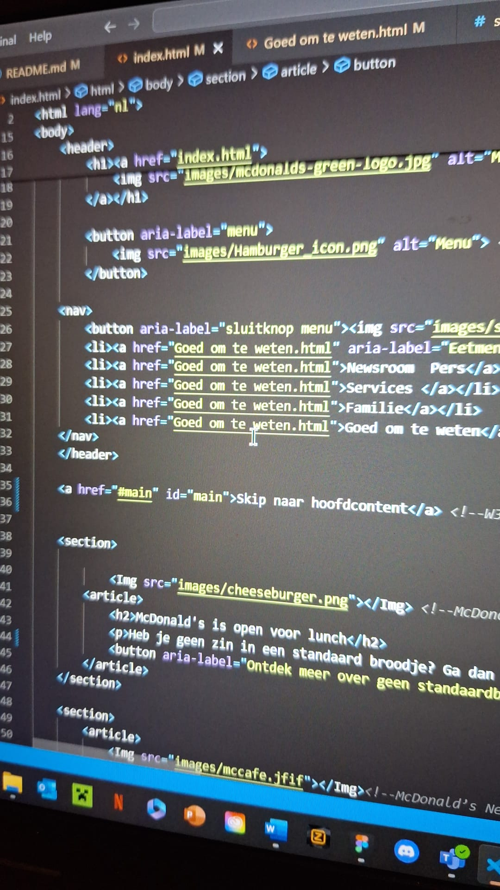
  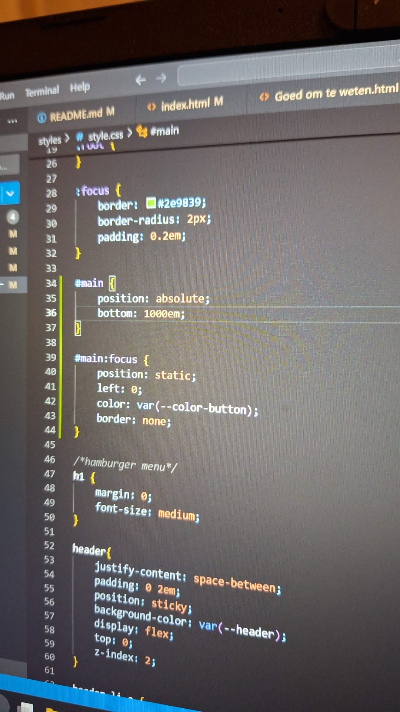
 

  

  

## Bronnenlijst

  - Avison, J. (2020, January 9). McDonald’s Green European Revolution. Into the Consumerverse. https://theconsumerverse.wordpress.com/2019/10/11/mcdonalds-green-european-revolution/
  -Call 610 - 465 - - White Hamburger Menu Icon PNG - (1168x1084) pNg clipart download. ClipartMax.com. (n.d.). ClipartMax.com. https://www.clipartmax.com/max/m2i8G6G6b1m2A0G6/
  - McDonald’s Nederland: Burgers, Franse Friet en veel meer! (n.d.). https://www.mcdonalds.com/nl/nl-nl.html
  - Goed om te weten. (n.d.). https://www.mcdonalds.com/nl/nl-nl/goedomteweten.html
  - Speedee Fonts Free download. (n.d.). OnlineWebFonts. https://www.onlinewebfonts.com/search?q=Speedee
  - Grid Garden. (n.d.). Een Spel Om CSS Grid Te Leren. https://cssgridgarden.com/#nl
  - Positioning a Button on the Bottom of a Div. (z.d.). | SheCodes. https://www.shecodes.io/athena/4505-positioning-a-button-on-the-bottom-of-a-div
  - Equal width columns in CSS Grid. (n.d.). Stack Overflow. https://stackoverflow.com/questions/47601564/equal-width-columns-in-css-grid
  - voor Het hamburgermenu heb ik de opdrachten uit codepen gebruikt. Alleen kwam ik er bij een paar stappen niet uit, dus heb ik om hulp gevraagd aan een medestudent (Kelly Kha). Zij had de opdracht wel al uitgevoerd.
  - W3Schools.com. (n.d.). https://www.w3schools.com/accessibility/accessibility_skip_links.php
  - ChatGPT. (n.d.). https://chatgpt.com/c/66f9c43e-4828-8010-8731-eafaa5b723e7 van de onderwijsassistent hoefde er geen a om de button te staan om het te laten werken, alleen werkten de linkjes daardoor niet. Dus heb ik het proberen op te zoeken en uiteindelijk heb ik het aan chat gpt gevraagd.

